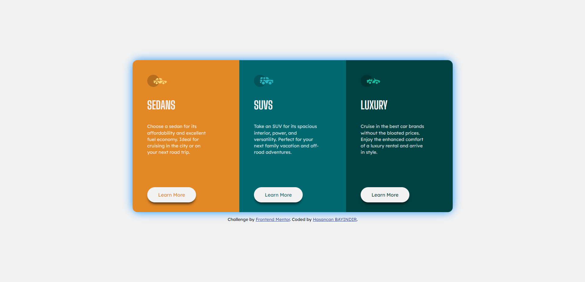

# Frontend Mentor - 3-column preview card component



### Built with

- Semantic HTML5 markup
- CSS custom properties
- Flexbox

### What I learned


```html
Some CSS code I'm proud of
```

```css
body {
    font-family: 'Big Shoulders Display', cursive;
    font-family: 'Lexend Deca', sans-serif;
    display: flex;
    flex-direction: column;
    justify-content: center;
    align-items: center;
    font-size: 15px;
    background-color: hsl(0, 0%, 95%);
    height: 100vh;
}

main {
    margin: 0 auto;
    display: flex;
    justify-content: center;
    align-items: center;
}


@media only screen and (max-width: 768px) {

    body {
        .
        .
        .
        .
        margin: 6em 0 6em 0;
    }

    main {
        display: flex;
        flex-direction: column;
        justify-content: center;
        align-items: center;
    }

    section:first-child {
        border-radius: 1rem 1rem 0 0;
    }

    section:last-child {
        border-radius: 0 0 1rem 1rem;
    }

    section {
        display: flex;
        flex-direction: column;
        justify-content: flex-start;
        align-items: flex-start;
        padding: 3rem 2.625rem 2rem 3rem;
        height: 450px;
        width: 350px;
    }

    .card-sedan p {
        padding: 0 3em 3em 0;
    }

    .card-suv p {
        padding: 0 3em 3em 0;
    }

    .card-luxury p {
        padding: 0 3em 3em 0;
    }
}
```

## Got feedback for me?

I need your valuable comments for improve myself. So please leave comment under this project. Thank you so much :)
